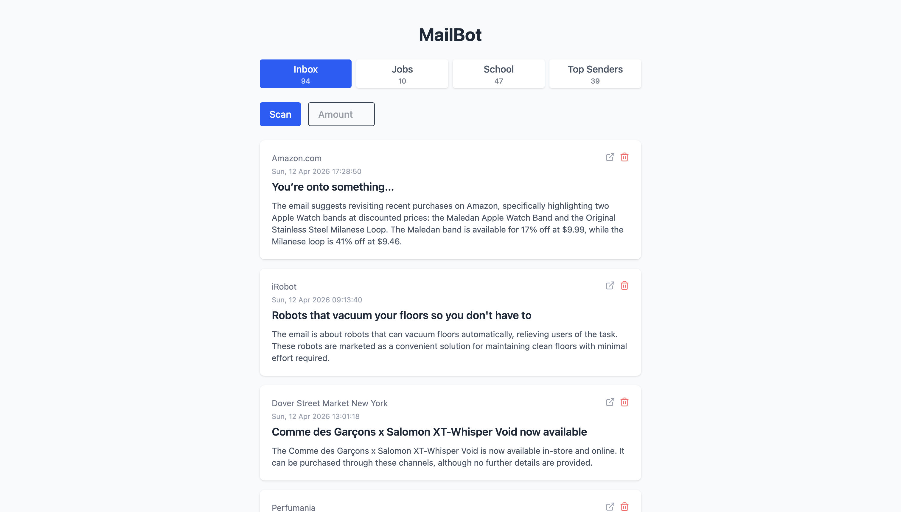
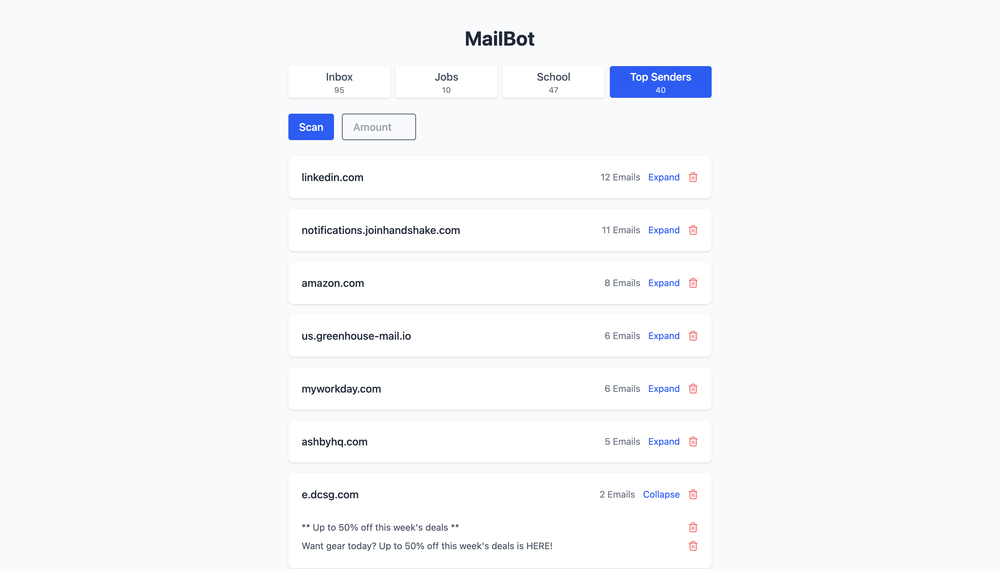

# MailBot

A personal email management tool that uses a locally running LLM to summarize emails, surface job opportunities, and identify recurring senders for bulk deletion.

## Screenshots




## Features

- **Inbox** — summarizes recent emails in 2 sentences using a local LLM
- **Jobs** — filters emails by job-related keywords and summarizes actionable ones (interviews, assessments, next steps)
- **School** — fetches and summarizes emails sent to a school email address forwarded to your main inbox
- **Top Senders** — groups emails by sender domain for bulk deletion

## Tech Stack

**Frontend**
- React + TypeScript
- Tailwind CSS

**Backend**
- Python + FastAPI
- Gmail API (OAuth2)
- Local LLM via LM Studio (Llama 3.1 8B)

## Performance

Benchmarked several models before settling on Llama 3.1 8B (~1s/email):
- Gemma 4 — ~8s/email
- Mistral 7B — ~2s/email
- Llama 3.1 8B — ~1s/email

In-memory caching reduces repeat summarization to 0ms.

## Setup

### Prerequisites
- [LM Studio](https://lmstudio.ai/) running Llama 3.1 8B on your local network
- A Google Cloud project with the Gmail API enabled and OAuth2 credentials

### Backend

```bash
cd backend
python -m venv venv
source venv/bin/activate
pip install -r requirements.txt
```

Create a `.env` file in the `backend` folder:
```
SCHOOL_EMAIL=your_school_email@example.com
LMSTUDIO_URL=http://your-lmstudio-ip:1234/v1
```

Place your `credentials.json` from Google Cloud in the `backend` folder, then run:
```bash
uvicorn main:app --reload
```

### Frontend

```bash
cd frontend
npm install
npm run dev
```

Open `http://localhost:5173`.
